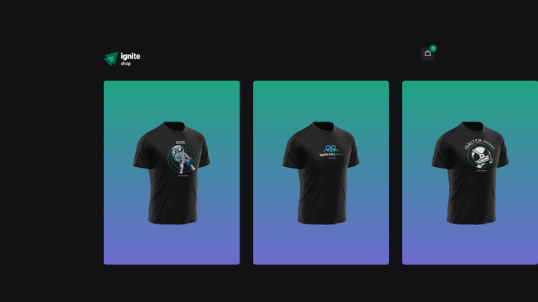

<h1 align="center"> GitHub Blog  </h1>

	The "ignite-shop" study project is a Next.js-based web application for online shopping featuring stripe integration and various dependencies such as axios, stitches, keen-slider, and use-shopping-cart.

  

 

  <h3 align='center'>Web</h3>
  

## ✅ Status

- Finished ✅

## 👨🏼‍💻 Functions

- Server Side Generation
- Static Generation

## 🚀 Technologies

This project used the following technologies:

- NextJS
- Typescript
- Stitches 
- Phosphor-React
- Axios
- Git e Github

## 💻 Project

This project was developed to solve the fourth challenge of Ignite's React track

- [Access the project finished, online](https://ignite-shop-eight-gules.vercel.app/)

## 🔖 Layout

- Access the project layout through [this link](https://www.figma.com/file/WeQbyxic3hLMDWWvCbAEyY/Ignite-Shop-2.0-%E2%80%A2-Desafio-React-(Copy)-(Copy)?type=design&node-id=2-12&mode=design&t=GIMeDkV3xRwOU10d-0). A [Figma](https://figma.com) account is required.

## :memo: License

- Excluding the layout, this project is under the license GPL-3
